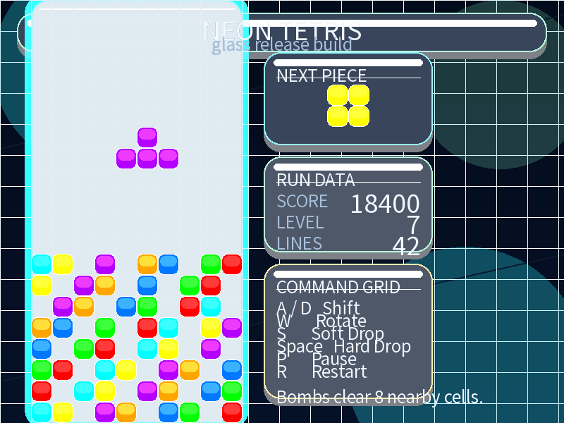

# Wooden Tetris

一个采用原木自然风格界面的 Pygame 俄罗斯方块项目，带有木纹面板、暖色配色。

A Pygame Tetris project with a warm wooden aesthetic, wood-grain panels, bundled font assets, and GitHub-friendly launch and test setup.



## 中文说明

### 项目亮点

- 原木自然风格界面：使用暖棕色调、木纹面板和复古街机机柜质感。
- ASCII 启动入口：`main.py` 是终端、命令行和 GitHub 文档中的主启动方式。
- 支持模块启动：可以直接在仓库根目录运行 `python -m tetris_app`。
- 模块化结构清晰：运行时、游戏状态、方块定义、主题、布局和渲染分层明确。
- 炸弹方块机制：特殊炸弹方块会清除周围 8 个格子。
- 自带字体资源：仓库内包含 `assets/fonts/NotoSansSC-Regular.ttf` 及授权文件。
- 支持无头回归测试：在 dummy SDL 环境下运行 smoke、输入节奏、状态逻辑和渲染测试。
- 已配置 GitHub CI：`.github/workflows/ci.yml` 会在 push 和 pull request 时自动校验。

### 快速开始

#### 环境要求

- Python 3.10+
- Pygame 2.6.1

#### 安装依赖

```bash
python -m pip install -r requirements.txt
```

开发和测试环境安装方式：

```bash
python -m pip install -e ".[test]"
```

#### 运行游戏

推荐启动方式：

```bash
python main.py
```

也可以用模块方式启动：

```bash
python -m tetris_app
```

兼容旧文件名的启动方式：

```bash
python "俄罗斯方块.py"
```

### 操作说明

- `A` / `D`：左右移动
- `W`：旋转
- `S`：加速下落
- `Space`：直接落到底
- `P`：暂停 / 继续
- `R`：重新开始

### 项目结构

```text
.
|-- .github/
|-- assets/
|   `-- fonts/
|-- docs/
|-- main.py
|-- tests/
|-- tetris_app/
|   |-- __main__.py
|   |-- app.py
|   |-- game_state.py
|   |-- launcher.py
|   |-- layout.py
|   |-- pieces.py
|   |-- renderers.py
|   |-- resources.py
|   `-- theme.py
`-- 俄罗斯方块.py
```

### 测试命令

```bash
python -m py_compile main.py tetris_app/__main__.py
python -m pytest -q
```

定向验证：

```bash
python -m pytest -q tests/test_smoke.py tests/test_input_repeat.py tests/test_game_state.py tests/test_render_smoke.py
```

### 发布说明

- 仓库保留了 `俄罗斯方块.py` 作为兼容入口，但 GitHub 文档中的标准启动命令是 `main.py`。
- 实际运行时代码位于 `tetris_app`，启动脚本本身保持轻量且导入时无副作用。
- 发布检查清单位于 [`docs/release-checklist.md`](./docs/release-checklist.md)。
- 字体授权信息位于 `assets/fonts/README.md` 和 `assets/fonts/OFL.txt`。

## English

### Highlights

- Wooden natural UI: a warm brown palette, wood-grain panels, and a retro cabinet feel.
- ASCII launcher: `main.py` is the primary entrypoint for terminals, shells, and GitHub docs.
- Module launcher: `python -m tetris_app` works from the repository root.
- Modular architecture: runtime, game state, pieces, theme, layout, and renderer layers are split cleanly.
- Bomb block mechanic: special bomb pieces clear the 8 surrounding cells.
- Bundled typography: the repo ships with `assets/fonts/NotoSansSC-Regular.ttf` and license metadata.
- Headless regression coverage: smoke, input timing, game-state, and render-smoke tests run under dummy SDL.
- GitHub CI: `.github/workflows/ci.yml` runs validation on push and pull request.

### Quick Start

#### Requirements

- Python 3.10+
- Pygame 2.6.1

#### Install

```bash
python -m pip install -r requirements.txt
```

For development and tests:

```bash
python -m pip install -e ".[test]"
```

#### Run

Recommended launcher:

```bash
python main.py
```

Alternative module launch:

```bash
python -m tetris_app
```

Legacy compatibility launcher:

```bash
python "俄罗斯方块.py"
```

### Controls

- `A` / `D`: move left or right
- `W`: rotate
- `S`: soft drop
- `Space`: hard drop
- `P`: pause / resume
- `R`: restart

### Project Structure

```text
.
|-- .github/
|-- assets/
|   `-- fonts/
|-- docs/
|-- main.py
|-- tests/
|-- tetris_app/
|   |-- __main__.py
|   |-- app.py
|   |-- game_state.py
|   |-- launcher.py
|   |-- layout.py
|   |-- pieces.py
|   |-- renderers.py
|   |-- resources.py
|   `-- theme.py
`-- 俄罗斯方块.py
```

### Test Commands

```bash
python -m py_compile main.py tetris_app/__main__.py
python -m pytest -q
```

Focused validation:

```bash
python -m pytest -q tests/test_smoke.py tests/test_input_repeat.py tests/test_game_state.py tests/test_render_smoke.py
```

### Release Notes

- The repository keeps `俄罗斯方块.py` as a compatibility launcher, but `main.py` is the canonical command for GitHub-facing docs.
- The actual runtime lives in `tetris_app`, keeping launchers thin and side-effect free on import.
- The repo includes a release checklist in [`docs/release-checklist.md`](./docs/release-checklist.md).
- Font licensing details live in `assets/fonts/README.md` and `assets/fonts/OFL.txt`.
